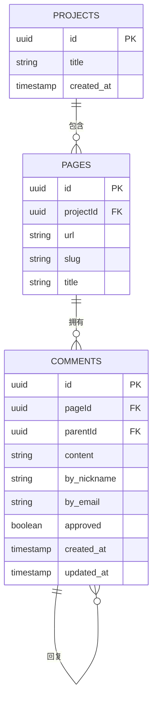
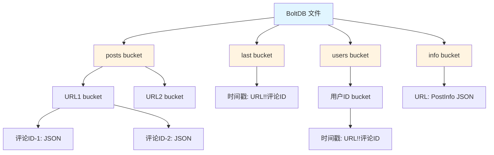
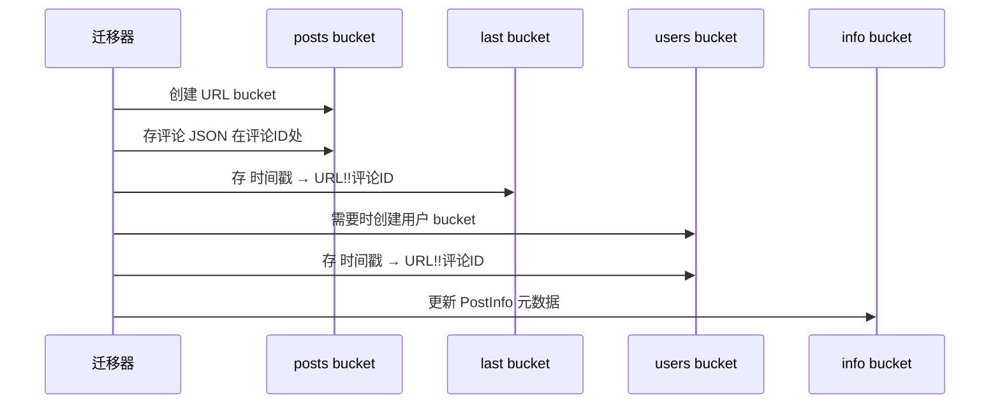
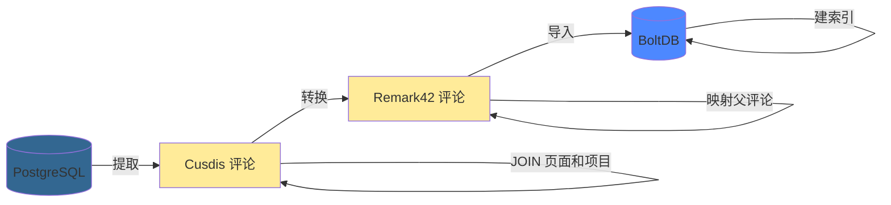

最近在重整这套 blog, 让 AI 写了个工具把评论从 Cusdis (PostgreSQL) 迁到 Remark42 (BoltDB)。核心问题：关系型数据转换成嵌套的键值结构。下面讲数据库差异和迁移实现。

## 数据库不匹配

**Cusdis**：PostgreSQL，标准化的关系型结构
**Remark42**：BoltDB（嵌入式 KV 存储），反标准化的嵌套 bucket

没有直接导入导出路径，因为存储范式完全不同。

## Cusdis 的数据结构（PostgreSQL）

标准的关系型结构：



Projects → Pages → Comments，外键维护关系。标准 PostgreSQL 优势：ACID 事务、复杂 JOIN、数据规范化。

提取查询：

```go
SELECT c.id, c.content, c.by_nickname, c.by_email,
       c.created_at, p.url, p.slug, p."projectId"
FROM comments c
INNER JOIN pages p ON c."pageId" = p.id
WHERE c.approved = true
ORDER BY c.created_at ASC
```

## Remark42 的数据结构（BoltDB）

BoltDB：基于 B+ 树的嵌入式键值存储，用嵌套 bucket 组织数据。没有独立数据库进程，应用直接打开文件。



数据按不同访问模式反规范化存储在多个 bucket：

| Bucket | Key | Value | 用途 |
|--------|-----|-------|------|
| `posts/<url>` | `commentID` | 评论 JSON | 直接查询 |
| `last` | `timestamp` | `URL!!commentID` | 时间序列 |
| `users/<userID>` | `timestamp` | `URL!!commentID` | 用户历史 |
| `info` | `URL` | PostInfo JSON | 元数据 |

关键特性：
- 单写入者设计（一个进程持有写锁）
- 基于 mmap 的读取（快）
- 不支持复杂查询（设计如此）
- 文件级 ACID 事务

适合评论系统，因为访问模式可预测：按 URL、用户 ID 或时间戳查询。不需要任意复杂查询。

## 迁移的核心问题

### 1. ID 映射

PostgreSQL 有外键。BoltDB 没有外键——必须手动在多个 bucket 间保持 ID 一致性。

方案：预生成所有新 ID 并维护映射表：

```go
// 第一遍：建 ID 映射
for _, comment := range cusdisComments {
    newID := uuid.New().String()
    idMapping[comment.ID] = newID
}

// 第二遍：用映射好的 ID 转换
for _, comment := range cusdisComments {
    remark42Comment.ID = idMapping[comment.ID]
    remark42Comment.ParentID = idMapping[comment.ParentID] // 已映射
}
```

### 2. 用户身份

Cusdis 分开存 `by_nickname` 和 `by_email`。Remark42 用一个 hash 过的 `User.ID`。

实现：

```go
func generateUserID(email, nickname string) string {
    key := email
    if key == "" {
        key = nickname
    }
    hash := sha1.Sum([]byte(key))
    return fmt.Sprintf("%x", hash)
}
```

同一用户的不同评论用同一 ID。缓存防止重复 hash。

### 3. 反规范化

PostgreSQL：规范化（每条评论通过外键引用页面）
BoltDB：反规范化（每条评论包含完整 URL 并在多处建索引）



每条评论写入 3-4 个位置：主存储、时间索引、用户索引、文章元数据。

## 实现

三阶段流程：



### 提取阶段

一条 JOIN 查询拉取评论及页面、项目数据：

```go
func (e *Extractor) ExtractComments(onlyApproved bool, projectIDs []string) {
    query := `
        SELECT c.id, c.content, c.by_nickname, c.by_email,
               p.url, p.slug, p."projectId"
        FROM comments c
        INNER JOIN pages p ON c."pageId" = p.id
        WHERE c.approved = $1 AND p."projectId" = ANY($2)
    `
    // 执行并映射到结构体...
}
```

要点：
- 按 `approved` 状态和 `projectId` 过滤
- 一条查询获取所有数据（无 N+1 问题）
- 按 `created_at` 排序保持时间顺序

### 转换阶段

范式转换在这里发生：

```go
type Transformer struct {
    idMapping   map[string]string  // Cusdis ID → Remark42 ID
    userIDCache map[string]string  // 邮箱 → SHA1 hash
}

func (t *Transformer) Transform(cusdisComments []CusdisComment) []remark42.Comment {
    // 1. 先生成所有新 ID
    for _, cc := range cusdisComments {
        t.idMapping[cc.ID] = uuid.New().String()
    }

    // 2. 用映射好的关系转换每条评论
    for _, cc := range cusdisComments {
        rc := remark42.Comment{
            ID:       t.idMapping[cc.ID],
            ParentID: t.idMapping[cc.ParentID], // 已映射！
            User: remark42.User{
                ID:   t.generateUserID(cc.ByEmail, cc.ByNickname),
                Name: cc.ByNickname,
            },
            // ... 更多映射
        }
    }
}
```

两遍处理确保父评论 ID 在子评论引用前已映射。也支持 URL 重映射（网站重构时有用）。

### 导入阶段

单个 BoltDB 事务原子写入所有评论：

```go
func (i *Importer) ImportComments(comments []Comment) error {
    return i.db.Update(func(tx *bolt.Tx) error {
        postsBucket := tx.CreateBucketIfNotExists([]byte("posts"))
        lastBucket := tx.CreateBucketIfNotExists([]byte("last"))
        usersBucket := tx.CreateBucketIfNotExists([]byte("users"))
        infoBucket := tx.CreateBucketIfNotExists([]byte("info"))

        for _, comment := range comments {
            // 存到 posts/<url>/<commentID>
            urlBucket := postsBucket.CreateBucketIfNotExists([]byte(comment.Locator.URL))
            commentJSON, _ := json.Marshal(comment)
            urlBucket.Put([]byte(comment.ID), commentJSON)

            // 在 last bucket 建索引
            timestampKey := comment.Timestamp.Format(time.RFC3339Nano)
            reference := fmt.Sprintf("%s!!%s", comment.Locator.URL, comment.ID)
            lastBucket.Put([]byte(timestampKey), []byte(reference))

            // 在 users bucket 建索引
            userBucket := usersBucket.CreateBucketIfNotExists([]byte(comment.User.ID))
            userBucket.Put([]byte(timestampKey), []byte(reference))

            // 更新文章信息...
        }
        return nil
    })
}
```

单事务的 all-or-nothing 语义。每条评论存到多个 bucket 以支持不同查询模式。

## 关键点

**范式转换是难点。** 外键 → 手动 ID 追踪。JOIN → 嵌套 bucket。引用完整性 → 应用层逻辑。

**预计算 ID 映射。** 在转换前生成所有新 ID，正确处理循环引用。

**为读模式反规范化。** BoltDB 的性能来自按读取方式存储数据，即使意味着重复。

**用 dry-run 模式。** 无副作用测试，在破坏数据前发现问题。

```bash
$ ./migrator --dry-run
[DRY RUN] 会导入 157 条评论
```

## 使用方法

```yaml
# config.yaml
cusdis:
  host: localhost
  database: cusdis
  user: postgres
  password: your_password

remark42:
  db_path: /var/remark42/remark.db
  site_id: your-site

migration:
  only_approved: true
  url_mapping:
    "cusdis-project-uuid": "https://yourdomain.com"
  url_remapping:  # 可选：URL 重构时使用
    "posts/old-slug": "posts/new-slug"
```

```bash
./cusdis-to-remark42-migrator --dry-run  # 测试
./cusdis-to-remark42-migrator            # 执行
```

## 性能

1000 条评论约 2 秒：
- 提取：500ms（PostgreSQL JOIN）
- 转换：100ms（纯 Go）
- 导入：1.4s（BoltDB 写入）

BoltDB 的单写入者设计导致顺序写入。一次性迁移可接受。

## 总结

跨数据库范式迁移需要理解它们的根本差异。PostgreSQL 的关系模型和 BoltDB 的键值结构针对不同场景优化。这里的模式——ID 预映射、用户 hash、反规范化——适用于任何关系型 ↔ KV 迁移。

---

**技术栈**：Go 1.21, PostgreSQL, BoltDB
**代码量**：~650 行
**迁移时间**：1000 条评论约 2 秒

## 延伸阅读

- [PostgreSQL 文档](https://www.postgresql.org/docs/)
- [BoltDB 设计文档](https://github.com/etcd-io/bbolt)
- [Remark42 架构](https://github.com/umputun/remark42)
- [什么时候用嵌入式数据库](https://www.sqlite.org/whentouse.html)（SQLite，但道理相通）
