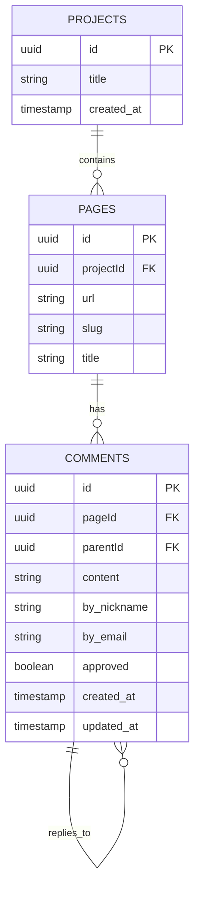
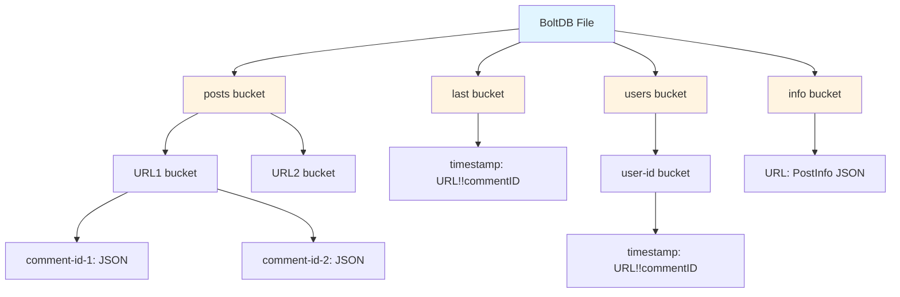
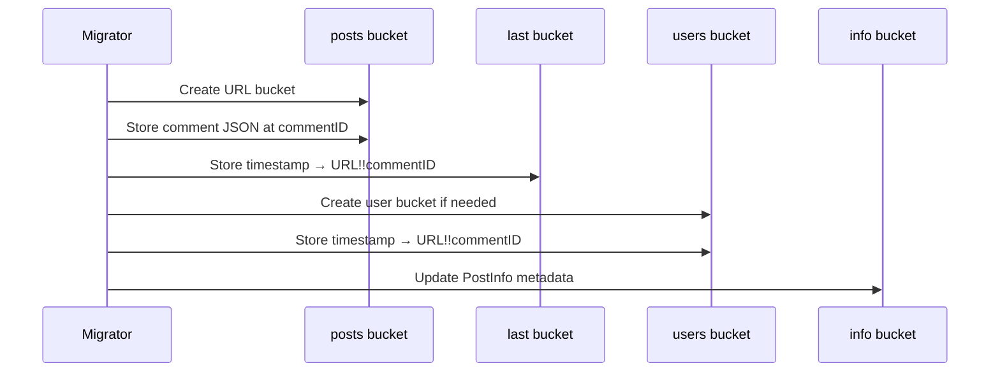
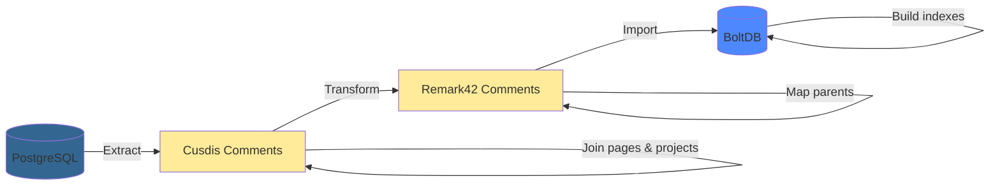

# Migrating Cusdis to Remark42: PostgreSQL to BoltDB

Built a migration tool to move comments from Cusdis (PostgreSQL) to Remark42 (BoltDB). The challenge: translating relational data to a nested key-value structure. Here's how the databases differ and how the migration works.

## The Database Mismatch

**Cusdis**: PostgreSQL with normalized relational schema
**Remark42**: BoltDB (embedded key-value store) with denormalized nested buckets

No direct export/import path exists because the storage paradigms are completely different.

## Cusdis Schema (PostgreSQL)

Standard normalized relational structure:



Projects → Pages → Comments, with foreign keys enforcing relationships. Standard PostgreSQL advantages: ACID transactions, complex JOINs, normalized storage.

Extraction query:

```go
SELECT c.id, c.content, c.by_nickname, c.by_email,
       c.created_at, p.url, p.slug, p."projectId"
FROM comments c
INNER JOIN pages p ON c."pageId" = p.id
WHERE c.approved = true
ORDER BY c.created_at ASC
```

## Remark42 Schema (BoltDB)

BoltDB: embedded key-value store using B+tree and nested buckets. No separate server process—just a file opened by the application.



Data is denormalized across multiple buckets for different access patterns:

| Bucket | Key | Value | Purpose |
|--------|-----|-------|---------|
| `posts/<url>` | `commentID` | Comment JSON | Direct lookup |
| `last` | `timestamp` | `URL!!commentID` | Chronological feed |
| `users/<userID>` | `timestamp` | `URL!!commentID` | User history |
| `info` | `URL` | PostInfo JSON | Metadata |

Key characteristics:
- Single-writer design (one process holds write lock)
- mmap-based reads (fast)
- No complex queries (by design)
- File-level ACID transactions

Works for comments because access patterns are predictable: lookup by URL, user ID, or timestamp. No need for arbitrary queries.

## Migration Challenges

### 1. ID Mapping

PostgreSQL uses foreign keys. BoltDB has no foreign keys—you must maintain ID consistency manually across buckets.

Solution: Pre-generate all new IDs and maintain a mapping:

```go
// First pass: create ID mappings
for _, comment := range cusdisComments {
    newID := uuid.New().String()
    idMapping[comment.ID] = newID
}

// Second pass: transform with mapped IDs
for _, comment := range cusdisComments {
    remark42Comment.ID = idMapping[comment.ID]
    remark42Comment.ParentID = idMapping[comment.ParentID] // Mapped!
}
```

### 2. User Identity

Cusdis stores `by_nickname` and `by_email` separately. Remark42 uses a single hashed `User.ID`.

Implementation:

```go
func generateUserID(email, nickname string) string {
    key := email
    if key == "" {
        key = nickname
    }
    hash := sha1.Sum([]byte(key))
    return fmt.Sprintf("%x", hash)
}
```

Same user across comments gets same ID. Cache prevents redundant hashing.

### 3. Denormalization

PostgreSQL: normalized (each comment references a page via foreign key)
BoltDB: denormalized (each comment includes full URL and is indexed in multiple locations)



Each comment writes to 3-4 locations: main comment store, chronological index, user index, and post metadata.

## Implementation

Three-phase pipeline:



### Extract Phase

Single JOIN query pulls comments with page and project data:

```go
func (e *Extractor) ExtractComments(onlyApproved bool, projectIDs []string) {
    query := `
        SELECT c.id, c.content, c.by_nickname, c.by_email,
               p.url, p.slug, p."projectId"
        FROM comments c
        INNER JOIN pages p ON c."pageId" = p.id
        WHERE c.approved = $1 AND p."projectId" = ANY($2)
    `
    // Execute and map to structs...
}
```

Key points:
- Filter by `approved` status and `projectId`
- One query gets all needed data (no N+1 problem)
- Order by `created_at` preserves chronology

### Transform Phase

Paradigm translation happens here:

```go
type Transformer struct {
    idMapping   map[string]string  // Cusdis ID → Remark42 ID
    userIDCache map[string]string  // Email → SHA1 hash
}

func (t *Transformer) Transform(cusdisComments []CusdisComment) []remark42.Comment {
    // 1. Generate all new IDs first
    for _, cc := range cusdisComments {
        t.idMapping[cc.ID] = uuid.New().String()
    }

    // 2. Transform each comment with mapped relationships
    for _, cc := range cusdisComments {
        rc := remark42.Comment{
            ID:       t.idMapping[cc.ID],
            ParentID: t.idMapping[cc.ParentID], // Mapped!
            User: remark42.User{
                ID:   t.generateUserID(cc.ByEmail, cc.ByNickname),
                Name: cc.ByNickname,
            },
            // ... more mapping
        }
    }
}
```

Two-pass approach ensures parent IDs are mapped before child comments reference them. Also handles URL remapping for site restructuring.

### Import Phase

Single BoltDB transaction writes all comments atomically:

```go
func (i *Importer) ImportComments(comments []Comment) error {
    return i.db.Update(func(tx *bolt.Tx) error {
        postsBucket := tx.CreateBucketIfNotExists([]byte("posts"))
        lastBucket := tx.CreateBucketIfNotExists([]byte("last"))
        usersBucket := tx.CreateBucketIfNotExists([]byte("users"))
        infoBucket := tx.CreateBucketIfNotExists([]byte("info"))

        for _, comment := range comments {
            // Store in posts/<url>/<commentID>
            urlBucket := postsBucket.CreateBucketIfNotExists([]byte(comment.Locator.URL))
            commentJSON, _ := json.Marshal(comment)
            urlBucket.Put([]byte(comment.ID), commentJSON)

            // Index in last bucket
            timestampKey := comment.Timestamp.Format(time.RFC3339Nano)
            reference := fmt.Sprintf("%s!!%s", comment.Locator.URL, comment.ID)
            lastBucket.Put([]byte(timestampKey), []byte(reference))

            // Index in users bucket
            userBucket := usersBucket.CreateBucketIfNotExists([]byte(comment.User.ID))
            userBucket.Put([]byte(timestampKey), []byte(reference))

            // Update post info...
        }
        return nil
    })
}
```

All-or-nothing semantics via single transaction. Each comment stored in multiple buckets for different query patterns.

## Key Takeaways

**Paradigm translation is the hard part.** Foreign keys → manual ID tracking. JOINs → nested buckets. Referential integrity → application logic.

**Pre-compute ID mappings.** Generate all new IDs before transformation to handle circular references correctly.

**Denormalize for read patterns.** BoltDB performance comes from storing data how you'll read it, even if that means duplication.

**Use dry-run mode.** Testing without side effects catches issues before they corrupt data.

```bash
$ ./migrator --dry-run
[DRY RUN] Would import 157 comments
```

## Usage

```yaml
# config.yaml
cusdis:
  host: localhost
  database: cusdis
  user: postgres
  password: your_password

remark42:
  db_path: /var/remark42/remark.db
  site_id: your-site

migration:
  only_approved: true
  url_mapping:
    "cusdis-project-uuid": "https://yourdomain.com"
  url_remapping:  # optional: for URL restructuring
    "posts/old-slug": "posts/new-slug"
```

```bash
./cusdis-to-remark42-migrator --dry-run  # test
./cusdis-to-remark42-migrator            # run
```

## Performance

1,000 comments in ~2 seconds:
- Extract: 500ms (PostgreSQL JOIN)
- Transform: 100ms (pure Go)
- Import: 1.4s (BoltDB writes)

Sequential writes due to BoltDB's single-writer design. Acceptable for one-time migrations.

## Conclusion

Migrating between database paradigms requires understanding their fundamental differences. PostgreSQL's relational model and BoltDB's key-value structure optimize for different use cases. The patterns here—ID pre-mapping, user hashing, denormalization—apply to any relational ↔ KV migration.

---

**Stack**: Go 1.21, PostgreSQL, BoltDB
**LOC**: ~650
**Migration time**: ~2s for 1,000 comments

## Further Reading

- [PostgreSQL Documentation](https://www.postgresql.org/docs/)
- [BoltDB Design Documentation](https://github.com/etcd-io/bbolt)
- [Remark42 Architecture](https://github.com/umputun/remark42)
- [When to Use Embedded Databases](https://www.sqlite.org/whentouse.html) (SQLite, but principles apply)
